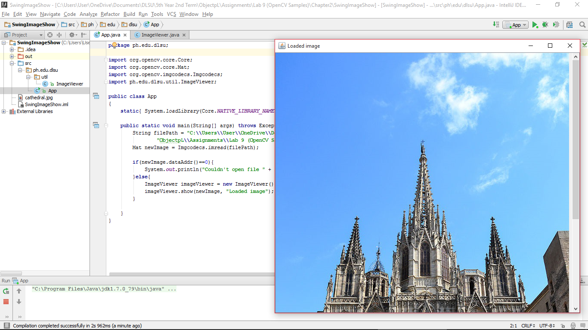

#SwingImageShow

Learning to open an image.

#ScreenShot

#Code

###App
~~~
package ph.edu.dlsu;

import org.opencv.core.Core;
import org.opencv.core.Mat;
import org.opencv.imgcodecs.Imgcodecs;
import ph.edu.dlsu.util.ImageViewer;

public class App
{
    static{ System.loadLibrary(Core.NATIVE_LIBRARY_NAME); }

    public static void main(String[] args) throws Exception {
        String filePath = "C:\\Users\\User\\OneDrive\\Documents\\DLSU\\5th Year 2nd Term\\" +
                "ObjectpL\\Assignments\\Lab 9 (OpenCV Samples)\\Chapter2\\SwingImageShow\\cathedral.jpg";
        Mat newImage = Imgcodecs.imread(filePath);

        if(newImage.dataAddr()==0){
            System.out.println("Couldn't open file " + filePath);
        }else{
            ImageViewer imageViewer = new ImageViewer();
            imageViewer.show(newImage, "Loaded image");
        }

    }
}
~~~

###ImageViewer
~~~
package ph.edu.dlsu.util;

import org.opencv.core.Mat;

import javax.swing.*;
import java.awt.*;
import java.awt.image.BufferedImage;
import java.awt.image.DataBufferByte;

public class ImageViewer {
    private JLabel imageView;

    public void show(Mat image){
        show(image, "");
    }

    public void show(Mat image,String windowName){
        setSystemLookAndFeel();

        JFrame frame = createJFrame(windowName);

        Image loadedImage = toBufferedImage(image);
        imageView.setIcon(new ImageIcon(loadedImage));

        frame.pack();
        frame.setLocationRelativeTo(null);
        frame.setVisible(true);

    }

    private JFrame createJFrame(String windowName) {
        JFrame frame = new JFrame(windowName);
        imageView = new JLabel();
        final JScrollPane imageScrollPane = new JScrollPane(imageView);
        imageScrollPane.setPreferredSize(new Dimension(640, 480));
        frame.add(imageScrollPane, BorderLayout.CENTER);
        frame.setDefaultCloseOperation(WindowConstants.EXIT_ON_CLOSE);
        return frame;
    }

    private void setSystemLookAndFeel() {
        try {
            UIManager.setLookAndFeel(UIManager.getSystemLookAndFeelClassName());
        } catch (ClassNotFoundException e) {
            e.printStackTrace();
        } catch (InstantiationException e) {
            e.printStackTrace();
        } catch (IllegalAccessException e) {
            e.printStackTrace();
        } catch (UnsupportedLookAndFeelException e) {
            e.printStackTrace();
        }
    }

    public Image toBufferedImage(Mat matrix){
        int type = BufferedImage.TYPE_BYTE_GRAY;
        if ( matrix.channels() > 1 ) {
            type = BufferedImage.TYPE_3BYTE_BGR;
        }
        int bufferSize = matrix.channels()*matrix.cols()*matrix.rows();
        byte [] buffer = new byte[bufferSize];
        matrix.get(0,0,buffer); // get all the pixels
        BufferedImage image = new BufferedImage(matrix.cols(),matrix.rows(), type);
        final byte[] targetPixels = ((DataBufferByte) image.getRaster().getDataBuffer()).getData();
        System.arraycopy(buffer, 0, targetPixels, 0, buffer.length);
        return image;
    }

}
~~~
